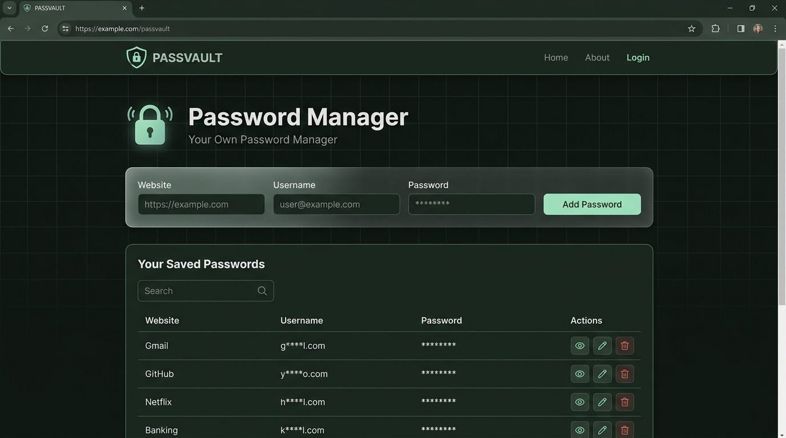
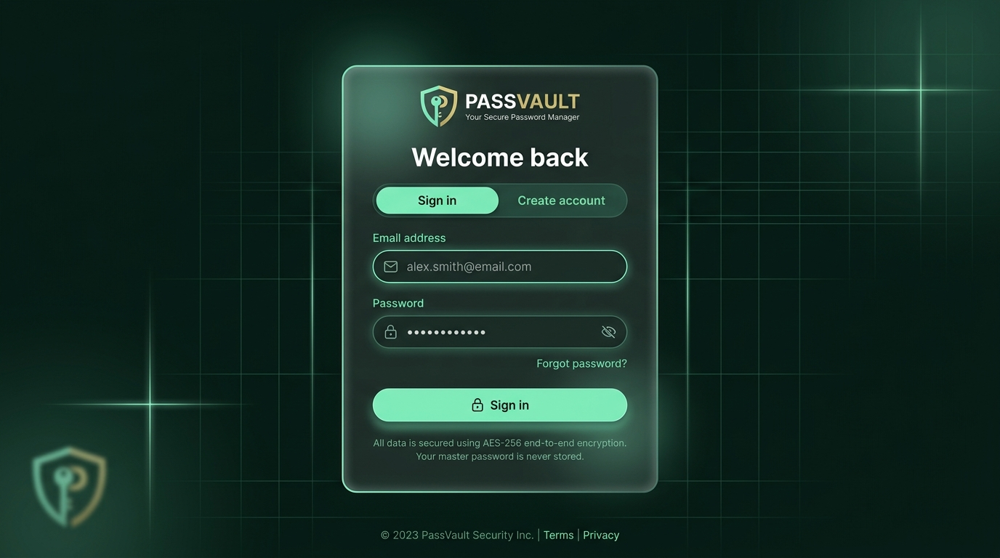
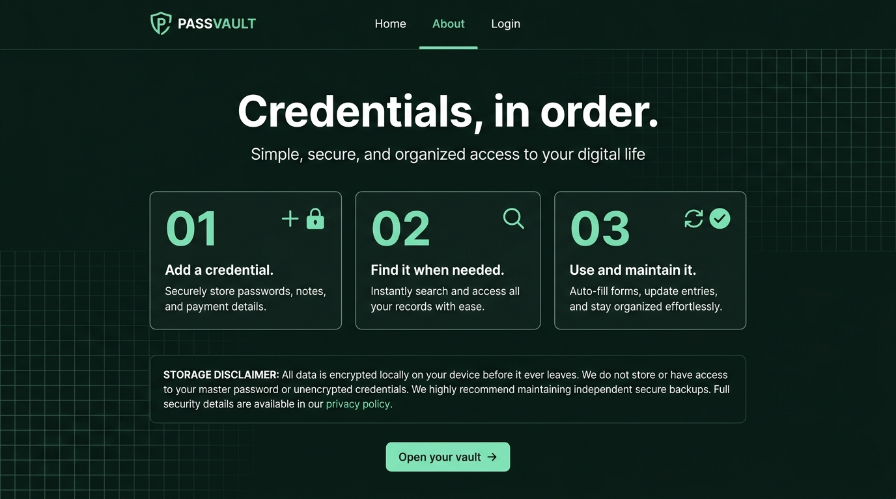
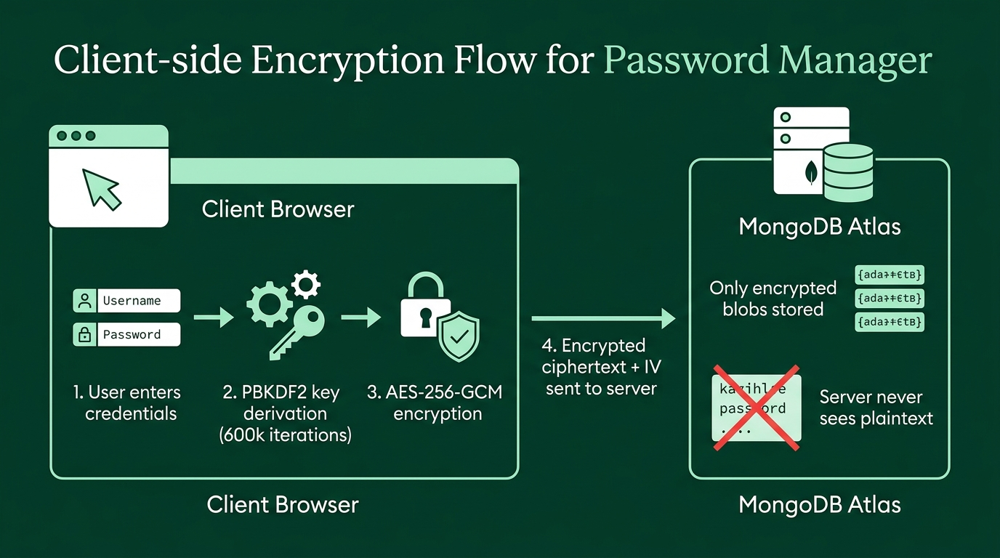

<p align="center">
  
</p>

<h1 align="center">PASSVAULT</h1>

<p align="center">
  <strong>A secure, client-side encrypted password manager with account-backed cloud storage.</strong>
</p>

<p align="center">
  <a href="#features">Features</a> •
  <a href="#screenshots">Screenshots</a> •
  <a href="#architecture">Architecture</a> •
  <a href="#getting-started">Getting Started</a> •
  <a href="#project-structure">Project Structure</a> •
  <a href="#security-model">Security Model</a> •
  <a href="#api-reference">API Reference</a> •
  <a href="#tech-stack">Tech Stack</a> •
  <a href="#contributing">Contributing</a>
</p>

<p align="center">
  
  
  
  
  
  
</p>

---

## ✨ Features

| Category | Highlights |
|---|---|
| **🔐 Zero-Knowledge Encryption** | Vault entries are encrypted in the browser using AES-256-GCM before ever reaching the server. The backend never sees plaintext credentials. |
| **👤 Dual Storage Modes** | Works instantly as a guest with `localStorage`, or sign in for account-backed encrypted cloud storage via MongoDB Atlas. |
| **🔍 Smart Search** | Case-insensitive search across website names, usernames, and passwords in real time. |
| **📄 Paginated Vault** | Browse saved credentials 10 entries per page with full pagination controls. |
| **👁️ Per-Row Reveal** | Usernames and passwords are masked by default. Reveal individual rows on demand without exposing the entire vault. |
| **📋 One-Click Copy** | Copy any field to the clipboard with a single click and animated confirmation feedback. |
| **✏️ Full CRUD** | Add, edit, and delete credentials. Edits scroll you back to the form with fields pre-filled. |
| **🌙 Premium Dark UI** | Handcrafted dark green design system with glassmorphism, micro-animations, and full mobile responsiveness. |
| **♿ Accessible** | Semantic HTML, ARIA labels, keyboard navigation, and `prefers-reduced-motion` support. |
| **🛡️ Hardened Backend** | Rate limiting, timing-safe password comparison, scrypt hashing, session tokens, same-origin validation, and security headers. |

---

## 📸 Screenshots

### 🏠 Home — Password Vault Dashboard

The main dashboard featuring the credential form, search bar, and paginated password table with reveal/copy/edit/delete actions.

<p align="center">
  
</p>

### 🔑 Authentication — Sign In & Create Account

A polished authentication experience with Sign In / Create Account toggle, email & password fields, and encryption disclaimers.

<p align="center">
  
</p>

### ℹ️ About — How It Works

A clean walkthrough of the three-step credential workflow and a transparent storage disclaimer.

<p align="center">
  
</p>

---

## 🏗️ Architecture

### Client-Side Encryption Flow

All vault data is encrypted in the browser **before** it's transmitted to the backend. The server only stores opaque ciphertext blobs.

<p align="center">
  
</p>

### System Overview

```
┌──────────────────────────────────────────────────────────┐
│                    CLIENT (Browser)                      │
│                                                          │
│  React 19 + Vite 8 + Tailwind CSS 4                     │
│  ┌──────────────┐  ┌──────────────┐  ┌───────────────┐  │
│  │   Navbar     │  │   Manager    │  │   AuthPage    │  │
│  │  Navigation  │  │  CRUD + UI   │  │  Sign In/Up   │  │
│  └──────────────┘  └──────────────┘  └───────────────┘  │
│                           │                     │        │
│                    ┌──────┴──────┐               │        │
│                    │ vaultCrypto │               │        │
│                    │ PBKDF2 +    │               │        │
│                    │ AES-256-GCM │               │        │
│                    └──────┬──────┘               │        │
│                           │ (encrypted)          │        │
└───────────────────────────┼──────────────────────┼───────┘
                            │  /api/vault          │  /api/auth
                     ┌──────┴──────────────────────┴───────┐
                     │        EXPRESS 5 BACKEND            │
                     │                                      │
                     │  • Session management (cookies)      │
                     │  • scrypt password hashing           │
                     │  • Rate limiting                     │
                     │  • Origin validation                 │
                     │  • Security headers                  │
                     └──────────────────┬───────────────────┘
                                        │
                                 ┌──────┴──────┐
                                 │  MongoDB    │
                                 │  Atlas      │
                                 │             │
                                 │  users      │
                                 │  sessions   │
                                 │  vaultRecs  │
                                 └─────────────┘
```

---

## 🚀 Getting Started

### Prerequisites

- **Node.js** ≥ 18
- **npm** ≥ 9
- **MongoDB Atlas** account (free tier works) — needed only for account-backed storage

### 1. Clone the repository

```bash
git clone https://github.com/your-username/PassManager.git
cd PassManager
```

### 2. Install dependencies

```bash
# Frontend dependencies
npm install

# Backend dependencies
npm install --prefix backend
```

### 3. Configure environment variables

```bash
cp backend/.env.example backend/.env
```

Edit `backend/.env` and set your MongoDB Atlas connection string:

```env
PORT=3000
MONGODB_URI=mongodb+srv://<user>:<password>@<cluster>.mongodb.net/
MONGODB_DB=passvault
NODE_ENV=development
APP_ORIGINS=http://localhost:5173,http://127.0.0.1:5173
```

> [!IMPORTANT]
> Keep your `backend/.env` private. It is already git-ignored. Never commit database credentials.

### 4. Start the application

Run both the frontend and backend together:

```bash
npm run dev:full
```

Or run them separately:

```bash
# Terminal 1 — Backend API
npm run dev --prefix backend

# Terminal 2 — Frontend
npm run dev
```

### 5. Open in browser

Navigate to **http://localhost:5173**

The frontend proxies `/api` requests to the backend on port `3000`.

> [!NOTE]
> Without MongoDB configured, the app works in **guest mode** using browser `localStorage`. Account features require a valid Atlas connection.

---

## 📁 Project Structure

```
PassManager/
├── public/
│   ├── favicon.svg          # App icon (SVG shield/lock)
│   ├── show.png             # Password visibility toggle icon
│   └── hide.png             # Password visibility toggle icon
├── src/
│   ├── main.jsx             # React entry point
│   ├── App.jsx              # Root component with routing & auth state
│   ├── App.css              # Complete design system (1300+ lines)
│   ├── index.css            # Global resets & font imports
│   ├── vaultCrypto.js       # Client-side encryption (PBKDF2 + AES-256-GCM)
│   └── components/
│       ├── Navbar.jsx       # Navigation with auth-aware links
│       ├── Manager.jsx      # Main vault — CRUD, search, pagination, reveal
│       ├── AuthPage.jsx     # Sign in / Sign up / Unlock vault
│       └── AboutPage.jsx    # Product info & workflow walkthrough
├── backend/
│   ├── server.js            # Express 5 API — auth, vault, sessions, security
│   ├── package.json         # Backend dependencies
│   ├── .env.example         # Environment template
│   └── .env                 # Local secrets (git-ignored)
├── docs/
│   └── screenshots/         # README images
├── index.html               # Vite HTML entry
├── vite.config.js           # Vite + React + Tailwind + API proxy
├── eslint.config.js         # ESLint configuration
├── package.json             # Frontend dependencies & scripts
└── .gitignore
```

---

## 🔒 Security Model

PASSVAULT implements a **zero-knowledge architecture** — the server never has access to your plaintext vault data.

### Encryption Pipeline

| Step | Operation | Details |
|------|-----------|---------|
| **1** | Key Derivation | `PBKDF2` with **600,000 iterations**, SHA-256, 16-byte random salt → 256-bit AES key |
| **2** | Encrypt | Each vault entry is serialized to JSON, then encrypted with `AES-256-GCM` using a unique 12-byte random IV |
| **3** | Store | Only `{ iv, ciphertext, version }` is sent to the server — never plaintext |
| **4** | Decrypt | On load, the browser re-derives the key from the user's password and decrypts locally |

### Server-Side Protections

| Protection | Implementation |
|------------|----------------|
| **Password Hashing** | `scrypt` (N=32768, r=8, p=1) with 16-byte random salt |
| **Timing-Safe Comparison** | `crypto.timingSafeEqual` prevents timing attacks on login |
| **Dummy Hash on Missing Users** | Login always performs a scrypt operation, preventing user enumeration |
| **Session Tokens** | 32-byte random tokens, SHA-256 hashed before storage, 7-day expiry |
| **HTTP-Only Cookies** | Session cookie is `httpOnly`, `sameSite: strict`, `secure` in production |
| **Rate Limiting** | 10 attempts per IP per endpoint per 15-minute window |
| **Origin Validation** | Requests require a whitelisted `Origin` header |
| **Security Headers** | `X-Content-Type-Options: nosniff`, `X-Frame-Options: DENY`, `Referrer-Policy: same-origin`, `Cache-Control: no-store` |

### Important Caveats

> [!CAUTION]
> - **Forgotten passwords cannot recover encrypted vault entries.** The encryption key is derived from your account password. There is no password reset mechanism for vault data.
> - **Guest-mode entries** stay in `localStorage` on the current device and are not automatically migrated into an account.
> - This project has **not undergone an independent security audit**. Use it for personal credential organization.

---

## 📡 API Reference

All API routes are prefixed with `/api`. The Vite dev server proxies these to the Express backend on port 3000.

### Health

| Method | Endpoint | Description |
|--------|----------|-------------|
| `GET` | `/api/health` | Returns server status and database connectivity |

### Authentication

| Method | Endpoint | Description |
|--------|----------|-------------|
| `POST` | `/api/auth/register` | Create a new account (email, password, encryptionSalt) |
| `POST` | `/api/auth/signin` | Sign in with email and password |
| `POST` | `/api/auth/unlock` | Re-enter password to derive encryption key (returning sessions) |
| `GET` | `/api/auth/me` | Get current authenticated user |
| `POST` | `/api/auth/signout` | Destroy the session and clear cookies |

### Vault (requires authentication)

| Method | Endpoint | Description |
|--------|----------|-------------|
| `GET` | `/api/vault` | Retrieve all encrypted vault records |
| `POST` | `/api/vault` | Create a new encrypted vault entry |
| `PUT` | `/api/vault/:id` | Update an existing encrypted vault entry |
| `DELETE` | `/api/vault/:id` | Delete a vault entry |

> [!NOTE]
> All vault endpoints accept and return **encrypted payloads** (`{ iv, ciphertext, version }`). The server validates the structure but cannot read the content.

---

## 🛠️ Tech Stack

### Frontend

| Technology | Version | Purpose |
|------------|---------|---------|
| [React](https://react.dev) | 19 | UI component library |
| [Vite](https://vite.dev) | 8 | Build tool & dev server |
| [Tailwind CSS](https://tailwindcss.com) | 4 | Utility-first CSS framework |
| [React Toastify](https://github.com/fkhadra/react-toastify) | 11 | Toast notification system |
| [Web Crypto API](https://developer.mozilla.org/en-US/docs/Web/API/Web_Crypto_API) | Native | Client-side encryption (PBKDF2 + AES-GCM) |

### Backend

| Technology | Version | Purpose |
|------------|---------|---------|
| [Express](https://expressjs.com) | 5 | HTTP server & API routing |
| [MongoDB Driver](https://www.mongodb.com/docs/drivers/node/current/) | 7 | Database connectivity |
| [cookie-parser](https://github.com/expressjs/cookie-parser) | 1.4 | HTTP cookie parsing |
| [dotenv](https://github.com/motdotla/dotenv) | 18 | Environment variable management |
| [Node.js Crypto](https://nodejs.org/api/crypto.html) | Native | scrypt hashing, HMAC sessions, secure randoms |

---

## 📜 Available Scripts

| Command | Description |
|---------|-------------|
| `npm run dev` | Start the Vite development server (frontend only) |
| `npm run dev:full` | Start both the frontend and backend concurrently |
| `npm run build` | Build the production frontend bundle |
| `npm run preview` | Preview the production build locally |
| `npm run lint` | Run ESLint across the codebase |
| `npm run dev --prefix backend` | Start the backend API with file watching |
| `npm run start --prefix backend` | Start the backend API for production |

---

## 🎨 Design System

PASSVAULT uses a custom dark green design system built for readability and eye comfort:

| Token | Value | Usage |
|-------|-------|-------|
| `--page` | `#111613` | Page background |
| `--surface` | `#191f1b` | Card backgrounds |
| `--surface-raised` | `#202923` | Elevated surfaces |
| `--accent` | `#a9e4bd` | Primary accent (buttons, links, highlights) |
| `--accent-strong` | `#c1f0cd` | Hover states & emphasis |
| `--text` | `#e6ece7` | Primary text |
| `--muted` | `#a0aaa2` | Secondary text |
| `--danger` | `#ff928a` | Destructive actions |

The design includes:
- **Glassmorphism** — backdrop blur and semi-transparent surfaces
- **Micro-animations** — lock float, button rotation, copy confirmation, edit tilt, delete nudge
- **Responsive breakpoints** — optimized layouts at 900px, 700px, and 600px
- **Reduced motion** — all animations respect `prefers-reduced-motion`

---

## 🤝 Contributing

Contributions are welcome! Here's how to get started:

1. **Fork** the repository
2. **Create** your feature branch (`git checkout -b feature/amazing-feature`)
3. **Commit** your changes (`git commit -m 'Add amazing feature'`)
4. **Push** to the branch (`git push origin feature/amazing-feature`)
5. **Open** a Pull Request

### Development Guidelines

- Follow the existing code style and ESLint configuration
- Maintain the dark green design system tokens for UI consistency
- Keep vault encryption client-side — never send plaintext to the backend
- Add appropriate ARIA labels for accessibility
- Test responsive layouts across breakpoints

---

## 📄 License

This project is licensed under the **ISC License**.

---

<p align="center">
  <sub>Built with ❤️ using React, Express, and the Web Crypto API</sub>
</p>
